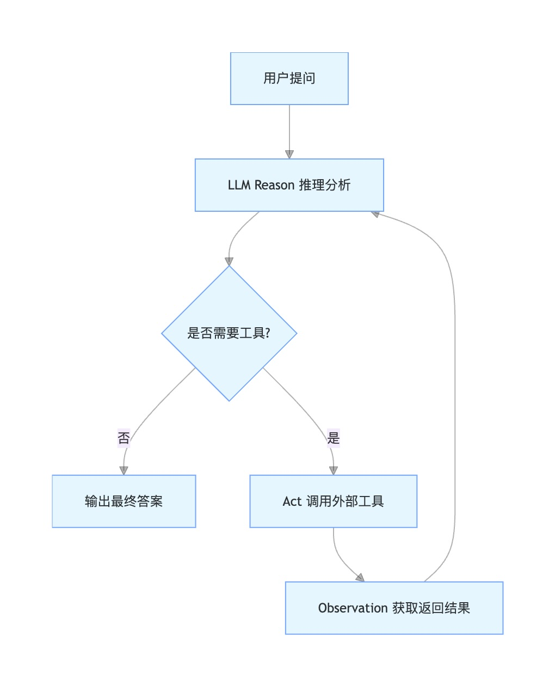

# mini agent 详解之：一个简单的多轮自处理模式

> 前言：本系列尽可能详细解读mini agent项目的各个原始基础功能部分，旨在对大模型的认知更近一步，项目github参考（喜欢请给该项目一个🌟以支持）：
https://github.com/jungrea/mini-agent

## 1. 多轮对话的要素
接上回，我们已经了解了使用claude sdk的模式，做了一次简单的调用工具式的一次性对话。我们假设已经学会了：
* 该sdk的标准对话输入参数结构；
* 工具的编写与输入；工具如何传入标准对话流；
* 模型基于用户输入问题+工具注册表，得到一个响应；
* 用户也知道了如何处理与解读这个响应；

以上如果你还没学会，建议再学一遍上节内容。

好了，现在我们需要在此基础上进行模型的多轮自处理。一个大的框架就是：模型拿到了工具调用的结构后，将结果信息作为新的输入信息，合并上一轮的信息一起再次请求大模型，直到大模型不再说要调用工具为止。这也是大模型自处理的典型框架之一：ReAct框架。

ReAct = Reason（推理思考） + Act（工具行动），核心思想：大模型通过交替循环获取最终答案：
* 先思考当前缺什么信息、该做什么
* 调用外部工具（搜索 / 计算器 / 数据库 / 接口）
* 拿到结果再继续推理，直到得出最终答案



## 2. 如何有效将工具结果添加到对话中
下面看看如何将上述这个过程实现。可以看到涉及到一个多次循环，次数还不一定是多少次，因此有一个
### 2.1 记录整体多轮次数的类：
```
@dataclass
class LoopState:
    # The minimal loop state: history, loop count, and why we continue.
    messages: list
    turn_count: int = 1
    transition_reason: Optional[str] = None
```
**功能**：
- 跟踪对话历史（`messages`）
- 记录循环次数（`turn_count`）
- 标记状态转换原因（`transition_reason`）

### 2.2 单次请求大模型的封装函数
其实就是上一节的做一次请求大模型的封装：
```
def run_one_turn(state: LoopState) -> bool:
    """
    执行一轮agent循环
    Args:
        state: 循环状态对象，包含对话历史等信息
    Returns:
        如果需要继续循环则返回True，否则返回False
    """
    print(f"本轮输入内容：{state.messages[-1]['content'][:200]}...")
    response = client.messages.create(
        model=MODEL,
        system=SYSTEM,
        messages=state.messages,
        tools=TOOLS,
        max_tokens=8000,
    )
    state.messages.append({"role": "assistant", "content": response.content})

    if response.stop_reason != "tool_use":
        print(f"【模型回复】 {extract_text(response.content)} !!! 工具状态：{response.stop_reason}，已经结束工具调用")
        state.transition_reason = None
        return False
    
    print(f"【模型回复】 {extract_text(response.content)} 工具状态：{response.stop_reason}")
    results = execute_tool_calls(response.content)
    if not results:
        state.transition_reason = None
        return False

    state.messages.append({"role": "user", "content": results})
    state.turn_count += 1
    state.transition_reason = "tool_result"
    return True
```
可以看到，整体思路就是有工具调用，拿到工具调用的所有结果`results = execute_tool_calls(response.content)`, 然后将结果append增加到messages中，本轮结束，因为还需要下一轮，所有返回True。否则返回false。

关于拿到所有工具的执行结果，这里以仅调用bash工具（即命令行执行命令）为例，子函数如下：
```
def execute_tool_calls(response_content) -> list[dict]:
    """
    执行模型请求的工具调用 -- 仅bash工具
    Args:
        response_content: 模型响应的内容列表
    Returns:
        工具执行结果的列表，每个结果包含type、tool_use_id和content字段
    """
    results = []
    for block in response_content:
        if block.type != "tool_use":
            continue
        command = block.input["command"]
        print(f"\033[33m$【此处调用了工具将执行bash命令】 {command}\033[0m")
        output = run_bash(command)
        print(f"【工具执行结果】 {output[:200]}")
        results.append({
            "type": "tool_result",
            "tool_use_id": block.id,
            "content": output,
        })
    return results

def run_bash(command: str) -> str:
    """
    执行bash命令并返回结果
    Args:
        command: 要执行的bash命令
    Returns:
        命令执行的输出结果，如果命令危险或执行失败则返回错误信息
    """
    dangerous = ["rm -rf /", "sudo", "shutdown", "reboot", "> /dev/"]
    if any(item in command for item in dangerous):
        return "Error: Dangerous command blocked"
    try:
        result = subprocess.run(
            command,
            shell=True,
            cwd=os.getcwd(),
            capture_output=True,
            text=True,
            timeout=120,
        )
    except subprocess.TimeoutExpired:
        return "Error: Timeout (120s)"
    except (FileNotFoundError, OSError) as e:
        return f"Error: {e}"

    output = (result.stdout + result.stderr).strip()
    return output[:50000] if output else "(no output)"

TOOLS = [{
    "name": "bash",
    "description": "Run a shell command in the current workspace.",
    "input_schema": {
        "type": "object",
        "properties": {"command": {"type": "string"}},
        "required": ["command"],
    },
}]
```

### 2.3 如何多次运行呢
在单次问答可执行后，只需要一个大while循环，就能一直执行多次循环了。
```
def agent_loop(state: LoopState) -> None:
    """
    持续执行agent循环
    Args:
        state: 循环状态对象，包含对话历史等信息
    """
    print(f"\n >>> 当前第 {state.turn_count} 轮循环，状态： {state.transition_reason}")
    while run_one_turn(state):
        print(f"\n >>> 当前第 {state.turn_count} 轮循环，状态： {state.transition_reason}")
        pass
```
即一个while循环判断run_one_turn的结果，直到为false，也就是不再有工具调用了。

### 2.4 一个主函数串起来
最后来一个主函数，串起来一次对话后，模型进行了多轮自循环后，退出本轮对话输出结果。
（本例只有一个run_bash工具，也就是只能使用一些命令行的代码来完成任务）
```
if __name__ == "__main__":
    history = []
    while True:
        try:
            query = input("\033[36ms01 >> \033[0m")
        except (EOFError, KeyboardInterrupt):
            break
        if query.strip().lower() in ("q", "exit", ""):
            break

        history.append({"role": "user", "content": query})
        state = LoopState(messages=history)
        agent_loop(state)

        print(f"\n >>> 本轮对话循环结束.")
        final_text = extract_text(history[-1]["content"])
        if final_text:
            print(final_text)
        print()
```
## 3. 测试一个任务
我们来测试一个任务看看一次对话后，模型是否能多轮调用工具执行。为了测试bash的命令，我们的任务如下：
`>> 看下当前目录是否有test.py文件，如果有，追加信息 hello world, 最后输出test.py。`
首先我们是有这个文件的，内容为：
```
HELLO WORLD
This is a test file
```
执行一下看看：
```
s01 >> 看下当前目录是否有test.py文件，如果有，追加信息 hello world, 最后输出test.py。

 >>> 当前第 1 轮循环，状态： None
本轮输入内容：看下当前目录是否有test.py文件，如果有，追加信息 hello world, 最后输出test.py。...
【模型回复】  工具状态：tool_use
$【此处调用了工具将执行bash命令】 ls test.py 2>/dev/null && echo "EXISTS" || echo "NOT_EXISTS"
【工具执行结果】 test.py
EXISTS

 >>> 当前第 2 轮循环，状态： tool_result
本轮输入内容：[{'type': 'tool_result', 'tool_use_id': 'call_00_ajeGr7UILoF0IAW9BAWgByok', 'content': 'test.py\nEXISTS'}]...
【模型回复】 文件存在，现在追加"hello world"并输出内容。 工具状态：tool_use
$【此处调用了工具将执行bash命令】echo "hello world" >> test.py && cat test.py
【工具执行结果】 HELLO WORLD
This is a test filehello world

 >>> 当前第 3 轮循环，状态： tool_result
本轮输入内容：[{'type': 'tool_result', 'tool_use_id': 'call_00_TgRa0TMS7ywYYwEO0Cv7ZzDT', 'content': 'HELLO WORLD\nThis is a test filehello world'}]...
【模型回复】 已完成操作。`test.py` 文件已存在，我向其追加了 "hello world" 信息，当前文件内容为：

HELLO WORLD
This is a test filehello world

 !!! 工具状态：end_turn，已经结束工具调用

>>> 本轮对话循环结束.
```

以上过程为一次对话后的完整调用过程。这一轮对话，大模型内部进行了3轮循环，前2次分别是：
* 1. 调用了ls看看是否有文件；
* 2. 发现有文件，然后使用 echo方法 往目标文件写数据；
* 3. 任务已完成，不需要调用工具了，结束。

至此一个普通的RecAct框架下的loop循环完成。后续无非是增加更多的TOOLS工具，实现更多的复杂功能，毕竟不同的任务必须要不同的工具才能完成，工具完成不了了就需要增加更多的模块来完成才行。


