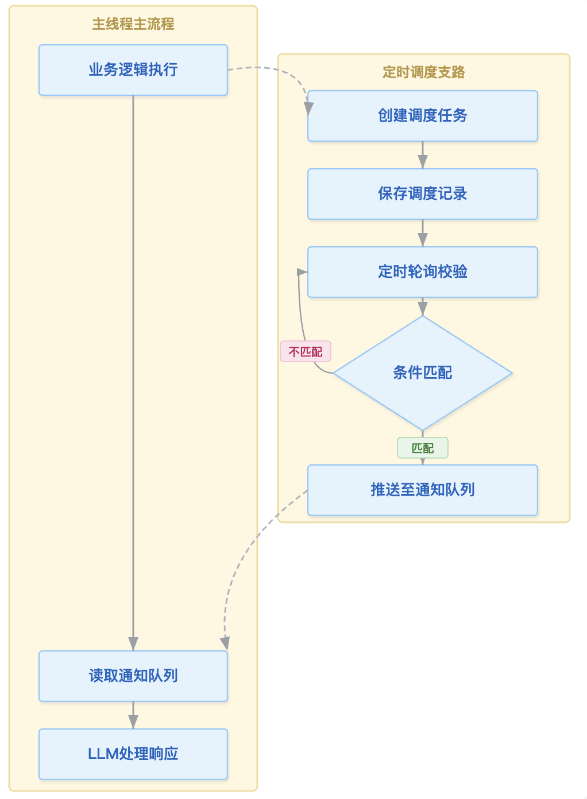

# s14_定时调度

本节我们来看一看Agent中的定时调度系统。

如果你用过OpenClaw或者Workbody此类AI办公软件，你应该看到过这样的功能，就是可以定时设置并执行某个任务，比如每天晚上总结工作内容，每天早上发一份调研报告等等，那么这些定时任务的实现都是靠定时调度系统来完成的。

## 1. 定时调度系统的模块

设想一下如果让你设计一个定时调度系统的时候，你觉得它应该至少包含哪些部分呢？

首先，既然是定时，那么得有一个时间控制来匹配是否到达了定时的时间。
其次，得有一个类或者方法，可以创建一个定时任务。
再者，定时任务应该固化到磁盘上，以防本次对话关闭之后，只要agent系统还在运行定时任务还能正常工作。同时定时任务所执行的内容也应该固化到磁盘上。

我们可以把整个模块叫做**调度器**，一段专门负责“看时间、查任务、决定是否触发”的代码。

### 1.1 创建定时模块

定时任务需要在用户发起后新建一个定时任务，至少包括执行时间、频次、执行内容。

在这里执行时间是以`cron`定时表达式来匹配当前系统时间来判定的。
格式如下：
```text
分 时 日 月 周
```
对于这种时间格式的解析含义如：

| 语法 | 含义 | 示例 |
| --- | --- | --- |
| `*` | 匹配任意值 | `* * * * *` = 每分钟 |
| `*/N` | 每 N 个单位 | `*/5 * * * *` = 每 5 分钟 |
| `N` | 精确匹配 | `30 14 * * *` = 每天 14:30 |
| `N-M` | 范围匹配 | `0 9-17 * * *` = 每小时整点 (9:00-17:00) |
| `N,M` | 列表匹配 | `0 9,12,18 * * *` = 9:00、12:00、18:00 |
| `N-M/S` | 范围内每 S 步长匹配 | `0-30/10 * * * *` = 0分、10分、20分、30分 |

### 1.2 定时执行模块

定时任务在创建好以后，生成如上格式的配置文件，之后定时任务就以一个后台进程的方式，每秒钟都会扫描当前所有的任务时间进行匹配，当匹配到某个任务应该触发时，就会执行相关任务。

这里需要理解的点，定时任务在主流程第一次启动的时候，就会启动一个后台任务进程，以某个时间间隔（比如1秒钟）进行轮询扫描匹配，命中某个时间规则后，就执行相关任务。

### 1.3 定时任务执行后响应

每一个定时任务都有唯一的id，在定时任务被后台正常执行完以后，就会将执行完的状态同步到某个数据结构或者数据写入某些固定位置，主循环中，每轮循环都可以扫描某个执行结果的数据结果是否有完成的定时任务，从而实现对定时任务的响应，如果需要响应的话。

本节的定时任务在触发后，是需要将任务的执行内容推送到主流程中，在主流程汇合了定时任务promot来完成的。

假设主循环中需要响应定时任务，那么一个简单的定时调度在主流程中的运转流程就是：



## 2. 定时系统的数据结构

定时系统的一个类结构应该包含至少以下子函数功能：
* 可以创建一条定时任务；
* 有一个一直处于运行状态的后台任务，用于遍历所有的定时任务是否需要执行。
* 定时任务执行之后的结果回传，状态更新等；

### 2.1 一个定时任务的模板
一个定时任务在被创建是应该具备一个记录各个属性的完整模板：
```python
schedule = {
    "id": "job_001",
    "cron": "0 9 * * 1",
    "prompt": "Run the weekly status report.",
    "recurring": True,
    "durable": True,
    "created_at": 1710000000.0,
    "last_fired_at": None,
}
```

字段含义：

- `id`：唯一编号
- `cron`：定时规则
- `prompt`：到点后要注入主循环的提示词（即将此段提示词汇入主流程中，主流程接下来的循环里面就会执行）
- `recurring`：是不是反复触发（也就是说可以控制是一次定时，还是总是定时触发）
- `durable`：是否落盘保存（是否需要保存一些结果）
- `created_at`：创建时间
- `last_fired_at`：上次触发时间

用这种方式就可以创建一个定时任务，那么创建定时任务的函数框架如下：
```python
def create(self, cron_expr: str, prompt: str, recurring: bool = True):
    job = {
        "id": new_id(),
        "cron": cron_expr,
        "prompt": prompt,
        "recurring": recurring,
        "created_at": time.time(),
        "last_fired_at": None,
    }
    self.jobs.append(job)
    return job
```

### 2.2 定时任务遍历执行

定时任务在初始化的时候，就启动了一个后台的进程，用于一直循环地扫描当前是否有需要执行的任务。定时检查循环的框架如下：

```python
def check_loop(self):
    while True:
        now = datetime.now()  # 当前时间
        self.check_jobs(now)  # 基于当前时间遍历所有定时任务
        time.sleep(60) # 1分钟一次遍历
```
首先，这个循环不是主循环里面，而是定时任务的新开的进程里面。

那么对于`check_jobs(now)`函数，在该函数中遍历所有的定时任务，与当前时间是否匹配？从而确定是否去执行。

```
def _check_tasks(self, now: datetime):
    """根据当前时间检查所有任务，触发匹配的任务。"""
    for task in self.tasks:
        ...
        check_time = now
        if cron_matches(task["cron"], check_time):
            notification = (
                f"[Scheduled task {task['id']}]: {task['prompt']}"
            )
            self.queue.put(notification)
        ...

```
核心流程也就这些：遍历定时任务，匹配成功后将定时任务的promote存储起来，并将状态保存到某个队列里面。

### 2.3 主循环中的正式执行

注意本节我们所讲的定时任务，最终都是汇合到主循环中去正儿八经的执行需求的，比如说你的需求是每天晚上整理日报，那么整理日报的这个Promot是存在定时任务里面的，而正儿八经的执行整理这个动作是在主循环中完成的，因为定时任务触发以后，会把这个prompt汇入到主循环里面，主循环通过调用大模型对话`client.messages.create`来进行完成整理的这个动作。

看下主循环的部分代码：
```
def agent_loop(messages: list):
    """
    在每次LLM调用之前，清空通知队列并将任何已触发的任务提示作为用户消息注入。
    """
    while True:
        # Drain scheduled task notifications
        notifications = scheduler.drain_notifications()
        for note in notifications:
            print(f"[Cron notification] {note[:100]}")
            messages.append({"role": "user", "content": note})

        response = client.messages.create(
            model=MODEL, system=SYSTEM, messages=messages,
            tools=TOOLS, max_tokens=8000,
        )
        messages.append({"role": "assistant", "content": response.content})
       ...

```
那么主循环里最核心的一点就是：
**notifications = scheduler.drain_notifications()**, 其实现如下：

```
    def drain_notifications(self) -> list[str]:
        """
        核心逻辑：使用无限循环 + get_nowait() 非阻塞获取
        - 能获取到消息 → 加入列表，继续
        - 队列空抛出 Empty 异常 → 捕获后 break 退出
        - 看似无限循环，但因为队列空必然退出，所以实际只执行有限次
        """
        notifications = []
        while True:  # 看似无限循环，但队列为空时必然退出
            try:
                # 非阻塞获取：队列有消息立即返回，队列空则抛出 Empty
                notifications.append(self.queue.get_nowait())
            except Empty:  # 队列空了 → 退出循环
                break
        return notifications
```

可以看到这一块就是将定时任务刚好在此刻完成了的定时匹配给捞了出来（也就是queue中的数据），同时把这些已经捞出来的再清空。而这个消息也正好被加到了message里面。因此在下一轮循环中，主循环就会执行对应的定时任务。

## 4. 定时任务如何新建的

了解完了定时任务的主体流程，那么定时任务如何创建呢？比如说你跟大模型讲，我想创建一个定时任务，它要怎么做才能创建呢？这里又涉及到了我们老生常谈的解决方法：创造工具、使用工具。

这里再简单说下通用工具的创建步骤：
1. 定义给大模型看的工具：TOOLS；
2. 工具函数的句柄引用：TOOL_HANDLERS，表示具体使用到的工具函数；
3. 具体执行的工具函数：自定义具体执行的函数；

那么对应到本节定时任务，我们对外暴露三个定时相关的工具：
* cron_create ： 定时任务创建
* cron_delete ： 定时任务删除
* cron_list ： 当前有哪些定时任务，显示定时任务列表

那么给大模型看的TOOLS可以定义如下：

```
TOOLS = [
    {"name": "cron_create", "description": "Schedule a recurring or one-shot task with a cron expression.",
     "input_schema": {"type": "object", "properties": {
         "cron": {"type": "string", "description": "5-field cron expression: 'min hour dom month dow'"},
         "prompt": {"type": "string", "description": "The prompt to inject when the task fires"},
         "recurring": {"type": "boolean", "description": "true=repeat, false=fire once then delete. Default true."},
         "durable": {"type": "boolean", "description": "true=persist to disk, false=session-only. Default false."},
     }, "required": ["cron", "prompt"]}},
    {"name": "cron_delete", "description": "Delete a scheduled task by ID.",
     "input_schema": {"type": "object", "properties": {
         "id": {"type": "string", "description": "Task ID to delete"},
     }, "required": ["id"]}},
    {"name": "cron_list", "description": "List all scheduled tasks.",
     "input_schema": {"type": "object", "properties": {}}},
]
```

那么这些工具的具体执行函数就在定时任务的类中，也就是`scheduler`这个类里面需要定义好相关的函数。
```
TOOL_HANDLERS = {
    "cron_create": lambda **kw: scheduler.create(
        kw["cron"], kw["prompt"], kw.get("recurring", True), kw.get("durable", False)),
    "cron_delete": lambda **kw: scheduler.delete(kw["id"]),
    "cron_list":   lambda **kw: scheduler.list_tasks(),
}
```

有了以上工具，我们就可以使用对话的方式来创建定时任务，以及管理相关的定时任务了。

## 4. 其他没提到的细节

定时任务主体逻辑介绍完了，我们说说一些没提到的细节。

* 一次性任务 vs 循环任务 vs 到期限的循环任务
有的时候我们的定时任务并不需要每天或者每周都执行，那么这个时候，定时任务的数据结构里面设定参数就非常重要。比如说你设置成一次性的任务，设置某个期限之前的任务，有对应的参数填充之后，只需要在代码解析的时候匹配这些参数解析即可。

* 如果有多个同一时间发生的定时任务怎么办？
上面我们可以看到，定时任务在指定时间触发之后，会汇入到主流程中去正式执行。那么如果两个任务同时在某个时间点触发了？按照上面的逻辑，应该会有两条定时任务promot汇入主流程，这可能会影响到主流程对于两个任务的执行效果。
那么一个解法就是，在定时任务触发时间上不用严格相等，而是做一些微小的抖动，比如说你定时的是10点执行。那随机抖动一下，可能是10.01，10.02分执行都可以，这是代码随机控制的。通过这种方式，一定程度可以避免相同定时的任务相撞的问题。

好了，本节我们主要了解定时任务的一个主体运转流程，了解它在Agent中是如何运转的，这样我们才能够更好地灵活运用它。

