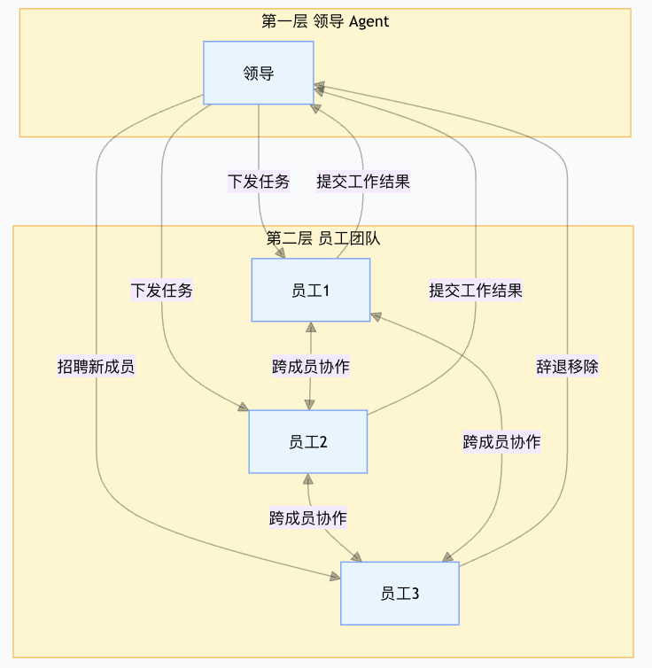
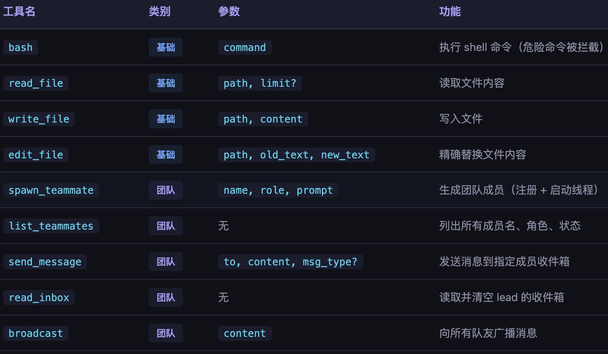
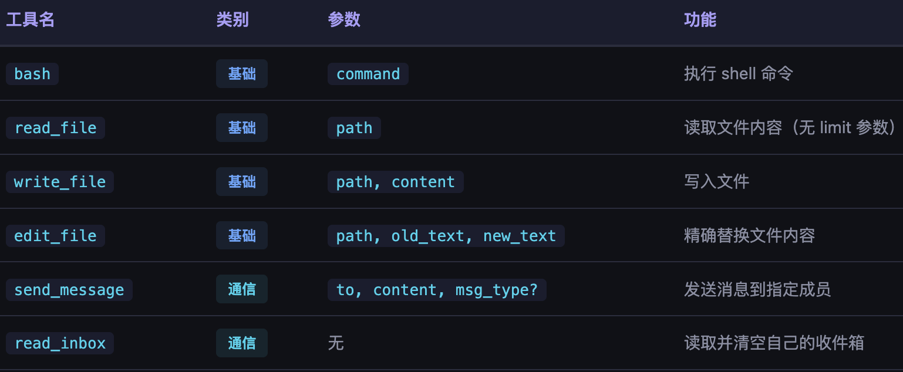

# s15_Agent团队协作

本节开始介绍Agent的团队协作模式，团队模式在claude code中已经是一个可以处理更复杂项目的功能了。所谓Agent的团队协作模式，就是有一系列分工不同的Agent合力来完成一个项目，每个agent可能有自己独特的功能，不同Agent之间又可以相互合作，最终实现对复杂任务更好的完成。就好比一个公司一样，有领导，有员工，并且不同员工职责不同，最终相互协作形成公司的战斗力。

## 1. Agent团队模式的工作原理

乍一看， Agent团队模式无非就是有很多的子Agent，这不和subagent那一节的内容重复了？其实两者还是有明显的区别的。回顾一下我们之前介绍的Subagent，其实是一种一次性的、单次会话内的、无任何身份的一种子Agent，会话结束也就结束了，并且如果生成了多个subagent，这些subagent之间也不好通信。而这些问题Agent团队模式都可以解决。

做一个一个详细对比如下：

| 对比维度 | **Subagent** | **Agent Teammate** |
| :--- | :--- | :--- |
| 生命周期 | 一次性 | 持久 |
| 执行流程 | `spawn -> execute -> return -> destroyed` | `spawn -> work -> idle -> work -> ... -> shutdown` |
| 通信方式 | 通过返回值向父代理汇报 | 通过 JSONL 收件箱异步收发 |
| 执行模式 | 在父代理的调用栈中同步运行 | 在独立线程中异步运行 |
| 身份命名 | 匿名，无持久身份 | 持久的名称（alice, bob...） |
| 状态管理 | 无（仅区分执行中/完成） | `working` / `idle` / `shutdown` |
| 适用场景 | 独立、可并行的子任务 | 需要多轮协作的长期任务 |

核心区别：子agent像函数调用（调用 -> 返回 -> 结束），agent团队成员像同事协作（各有各的工位，通过邮件沟通，可以反复工作）。

现在我们把Agent团队类比成“公司的领导和同事”来看看agent团队的一个工作模式。

* 领导角色：
  * 可以决定招聘员工、辞退员工;
  * 可以给员工派活;
  * 可以收集汇总员工的干活结果;
* 员工角色:
  * 可以接受领导的活并开始干活;
  * 不同员工之间还可以相互合作进行干活;
  * 可以提交干完的结果；

由此我们可以看到领导和员工的角色在工作内容和权力上是不一样的，也就是说，他们所具备的能力、所能使用的资源是不同的。用一个形象的图来表示，就如下所示：



记住这张图，可以说Agent团队协作的框架以及代码实现，几乎等同于这张图。

## 2. Agent团队协作需要的数据模块

### 2.1 本地化的数据存储

我们说Agent团队协作是一个具备持久化运行的功能，也就是说，它的相关内容是存在本地磁盘上的，这就引出了第一个问题：**团队模式是具有专门文件夹来存储相关数据内容的。**

举个例子我们先给出来相关目录：
```
.team/
  inbox/
    alice.jsonl  # alice 的收件箱
    bob.jsonl  # bob 的收件箱
    lead.jsonl  # lead 的收件箱
  config.json  # 团队配置 + 成员注册表
```
先做简单的初步认识，这些文件就代表着一些不同角色的agent相关的一些配置文件。

### 2.2 角色能力

### 2.2.1 leader角色

我们说leader角色是具有更大权限、更多功能的一个角色，他可以是Agent（负责管理别的agent）。在本教程中，为了简化，**我们认为我们自己是这个leader**，我们可以通过对话框的方式完成Leader角色的功能。那么leader角色应该具有哪些功能呢？

* 创建角色功能；
* 指派任务到具体某个角色；
* 可以发布全局消息到所有角色；
* 可以读取别的角色给我的消息；
* 其他通用功能；

在Agent中，所谓的功能就是调用工具的能力，以上功能我们可以认为是leader所具备的工具能力，汇总一下leader的工具表如下：



### 2.2.2 普通角色

普通角色我们认为是正常员工，负责执行不同功能的Agent。相比leader，很显然我们定义员工不具备生成员工的功能。比如说，我们定义员工所具备的能力（也就是工具）如下：



那么leader和普通员工所共有的能力，包括可以发送消息给指定成员（`send_message`），可以读取别人发给自己的消息（`read_inbox`）。

### 2.3 团队管理的类结构

将上面leader和员工所具有的能力抽象成一个类，这个类里面就实现了所有关于团队相关的一些具体的函数，我们把这个类定义为：`TeammateManager`.

该类的核心框架如下（省略部分具体实现只看主要逻辑）：

```
class TeammateManager:
    """持久的团队成员注册表和工作循环启动器。"""

    def __init__(self, team_dir: Path):
        # 一些文件夹配置
        self.dir = team_dir
        self.dir.mkdir(exist_ok=True)
        self.config_path = self.dir / "config.json"

    def spawn(self, name: str, role: str, prompt: str) -> str:
        """
        产生/生成/唤醒 一个团队成员，并开启一个成员运行的线程。

        关键设计：
        1. 成员创建后先进入 idle，等待 inbox 中的明确消息
        2. 使用 threading.Thread 创建守护线程
        3. config.json 持久化成员信息，重启后可恢复
        4. prompt 作为成员的长期身份说明，不再作为立即执行的任务

        状态转换：
        - idle/shutdown → idle（启动并等待消息）
        - idle → working（收到 inbox 消息并开始处理）
        - working → idle（当前消息处理完成）
       """
         # 省略具体实现

    def _teammate_loop(self, name: str, role: str, prompt: str):
        """
        团队成员的工作循环（运行在该员工的独立线程中）。

        循环逻辑：
        1. 最多迭代50次（防止无限循环）
        2. 每轮：读取收件箱 → 构建消息 → 调用LLM → 执行工具 → 收集结果
        3. 当LLM停止原因是"非tool_use"时，表示任务完成，退出循环

        消息来源：
        - 初始prompt（任务描述）
        - 后续收到的队友消息（从收件箱读取）
        """
        # 省略具体实现

    def _exec(self, sender: str, tool_name: str, args: dict) -> str:
        # 员工的具体可执行工具的函数
        if tool_name == "bash":
            return _run_bash(args["command"])
        if tool_name == "read_file":
            return _run_read(args["path"])
        if tool_name == "write_file":
            return _run_write(args["path"], args["content"])
        # 省略部分代码

    def _teammate_tools(self) -> list:
        # 员工的具体可执行工具表
        return [
            {"name": "bash", "description": "Run a shell command.",
             "input_schema": {"type": "object", "properties": {"command": {"type": "string"}}, "required": ["command"]}},
            {"name": "read_file", "description": "Read file contents.",
             "input_schema": {"type": "object", "properties": {"path": {"type": "string"}}, "required": ["path"]}},
            # 省略部分代码
        ]

    def list_all(self) -> str:
        # 列举所有员工
        if not self.config["members"]:
            return "No teammates."
        lines = [f"Team: {self.config['team_name']}"]
        for m in self.config["members"]:
            lines.append(f"  {m['name']} ({m['role']}): {m['status']}")
        return "\n".join(lines)

    def member_names(self) -> list:
        return [m["name"] for m in self.config["members"]]
```

上述类定义了一些函数（有leader调用的，有员工调用的），有几个核心的关键点我觉得值得关注:

* `spawn`函数：是一个生成或者唤醒一个员工进行干活的函数。当这个函数被调用之后，如果员工不存在，那么会创建一个这个员工，如果员工存在，那么就使用一个已存在的员工进行干活。干活的员工会在后台新建一个独立的线程Agent，员工具有自己的独立上下文。直到指定的任务完成后更新自己的状态。

* 员工有自己的子循环：通过看这个函数`_teammate_loop`（被`spawn`函数所调用）,每个员工被创造出来以后，都有自己的内循环，有最大循环次数，有员工可调用的工具列表，和主线程里面正常的一个Agent工具RecAct流程几乎一样。

### 2.4 团队通信机制

我们看了领导和员工的执行函数，那么领导和员工以及员工与员工之间则需要通过一定的消息机制来进行通信和协作。

我们定义一个新的类`MessageBus`,是团队通信的核心基础设施，该类提供三种操作，还是直接看类定义框架：

```
class MessageBus:
    def __init__(self, inbox_dir: Path):
        self.dir = inbox_dir
        self.dir.mkdir(parents=True, exist_ok=True)

    def send(self, sender: str, to: str, content: str,
             msg_type: str = "message", extra: dict = None) -> str:
        """
        发送消息到指定成员的发件箱（JSONL文件）。

        持久化消息的设计：
        - 每条消息追加写入 {to}.jsonl 文件（append模式）
        - 使用 JSONL 格式（每行一个JSON对象），便于追加和解析
        - 消息包含：type, from, content, timestamp, 以及可选的extra字段

        这种设计允许：
        1. 消息持久化（重启后仍在）
        2. 异步处理（发送者不阻塞等待响应）
        3. 简单的点对点通信
        """

    def read_inbox(self, name: str) -> list:
        """
        读取并清空成员名称为name的发件箱。

        关键设计：读取后立即清空文件（write_text("")）
        - 这是一种"取出"操作，不是"偷看"
        - 防止消息被重复处理
        - 代价是无法回溯历史消息
        """

    def broadcast(self, sender: str, content: str, teammates: list) -> str:
        """
        向所有队友广播消息。
        实现：遍历队友列表，排除发送者，逐个调用send方法。
        """
```

核心就三个函数：
* 成员A发送给成员B消息的函数：`send`,包括具体内容，以及持久化存在本地。
* 某个成员读取自己要处理的消息：`read_inbox`, 成员通过读取这个函数来得到自己的任务内容，并清空该内容（因为已经开始干了不应该在存在内存中的任务消息中）。
* 广播消息：`broadcast`这是可以向所有成员发送消息的函数。比如说leader向所有成员发送了一条任务需求，那么所有成员都将执行这个任务需求。

### 2.5 成员的状态管理与流转

所谓成员的状态，就是说当前这个员工当前处于什么状态？是已经在干活了还是干完了空闲了还是已经下线了？如果一个员工已经在干活了，这个时候你再给他派活是不可以的，只有当他是空闲的时候，你给他派活，他才可以执行。

那么一个成员的状态有以下几种状态类型：
- **working**：正在执行任务。该员工agent的内循环正在运行。
- **idle**：空闲等待。上一轮任务已完成，可以再次被 spawn 唤醒继续工作。
- **shutdown**：已关闭。线程已退出，需要重新 spawn 才能恢复工作。

一个员工通过一个状态变成另外一个状态通常是某个函数被调用（如spawn）或者某个任务被执行完之后，触发的对应的动作才更新状态：
- idle -- spawn --> working ： 调用 spawn_teammate 重新唤醒
- shutdown -- spawn --> working：调用 spawn_teammate 重新启动
- working -- 循环结束 --> idle： LLM 自然结束 (stop_reason != "tool_use") 或达到 50 轮上限
- working -- shutdown_request --> shutdown：收到关闭请求，线程退出

所有员工当前是什么状态，都是由一个本地的配置文件来管理的，当员工的状态发生了变化的时候，都是需要更新这个配置文件（`config.json`）的,比如该配置文件大概长如下样子：
```
{
    "team_name": "default",
    "members": [
        {
            "name": "alice",
            "role": "开发工程师",
            "status": "idle"
        },
        {
            "name": "前端开发员",
            "role": "前端开发专家",
            "status": "working"
        },
        {
            "name": "后端开发员",
            "role": "后端开发专家",
            "status": "working"
        }
    ]
}
```
这里就表示有两个员工目前正在干活，而另外一个员工现在处于空闲状态。

## 3. 串一下完整流程

了解了Agent团队协作的各个模块之后，那么我们就可以清晰地画出它的一个核心框架图：
```
Lead (主线程)
  |
  +-- spawn_teammate("alice", "coder", "fix the bug")
  |     |
  |     +-- Thread: alice  (独立 agent_loop)
  |           |
  |           +-- read_inbox("alice")  ->  获取消息
  |           +-- LLM 调用             ->  决策
  |           +-- 执行工具              ->  产生结果
  |           +-- send_message("lead", result)  ->  回复
  |
  +-- spawn_teammate("bob", "reviewer", "review PR")
  |     |
  |     +-- Thread: bob  (独立 agent_loop)
  |
  +-- read_inbox("lead")  ->  收取回复
```

我们把自己当成leader，那么我们具有Leader所专属的工具箱，我们可以生成员工，也可以启动一个已有的员工，让他继续干活（写消息）。员工在收到Leader的命令后（读消息），开启一个子进程，以一个完整的Agent方式来运行，任务完成后，再把相关的结果写回给leader，Leader可以继续布置任务，也可以基于员工反馈的信息来做下一步的打算。

## 4. 实例演示

我们通过Agent团队协作的模式生成两个员工，一个员工用来生成代码，另外一个员工负责检验代码。我们把所有的细节、执行过程都打印出来：

* 首先来创建一个团队
```
s15 >> 创建一个开发团队，alice 负责写代码，bob 负责代码审查

[Leader] 创建队友 alice (Developer)，等待 inbox 任务
[Leader] 创建队友 bob (Code Reviewer)，等待 inbox 任务
团队成员已经就位！以下是团队的概况：

---

## ✅ 开发团队已创建

| 成员 | 角色 | 职责 |
|------|------|------|
| **Alice** | 👩‍💻 Developer | 负责编写高质量代码 |
| **Bob** | 👨‍🔬 Code Reviewer | 负责代码审查，确保质量达标 |

**工作流程：**
1. **Alice** 先写出代码，并说明实现思路
2. **Bob** 审查代码，检查风格、bug、性能和安全性
3. 双方确认后代码才能合并

---

有什么功能需要让这个团队开始工作吗？比如"写一个函数实现 XXX"之类的需求？
```
那么我们看下生成的配置文件`config.json`：
```
{
    "team_name": "default",
    "members": [
        {
            "name": "alice",
            "role": "开发者",
            "status": "idle"
        },
        {
            "name": "bob",
            "role": "代码审查员",
            "status": "idle"
        }
    ]
}
```

* 现在让团队来干活：

```
s15 >> 让Alice开发一个贪吃蛇网页版游戏，完成后发给 Bob 审查

[Leader] 分配/发送消息给 alice: Alice，请开发一个贪吃蛇网页版游戏。需求如下：  1. 使用纯 HTML + CSS + JavaScript（单文件） 2. 有游戏画布、蛇的移动、食物生成、得分显示 3. 支持方向键控制 4. 撞墙或撞自己游戏结束 5. 界面简洁美...
[队友 alice] 执行工具 bash: LICENSE README-ja.md README-zh.md README.md WEATHER_README.md WEATHER_TOOL_SUMMARY.md __pycache__ agents agents_md_doc d...
[队友 alice] 执行工具 bash: README.md next.config.ts package-lock.json package.json postcss.config.mjs public scripts src tsconfig.json vercel.json
[Leader] 等待中 5s，Team: default |   alice (开发者): working |   bob (代码审查员): idle
[Leader] 等待中 20s，Team: default |   alice (开发者): working |   bob (代码审查员): idle
[Leader] 等待中 35s，Team: default |   alice (开发者): working |   bob (代码审查员): idle
[队友 alice] 执行工具 write_file: Wrote 25760 bytes
[队友 alice] 执行工具 bash: -rw-r--r--@ 1 staff    26K  5 30 17:18 /work/learn-claude-code-main/web/snake_game.html
[Leader] 等待中 40s，Team: default |   alice (开发者): working |   bob (代码审查员): idle
[队友 alice] 发送消息给 lead: 贪吃蛇游戏已完成，文件路径：`web/snake_game.html`  ## 功能清单  1. **纯单文件 HTML + CSS + JavaScript**，无外部依赖 2. **游戏画布**：20x20 网格，400x400px，带...
[Leader] 收到 1 条队友消息，准备决定下一步
[Leader]   来自 alice: 贪吃蛇游戏已完成，文件路径：`web/snake_game.html`  ## 功能清单  1. **纯单文件 HTML + CSS + JavaScript**，无外部依赖 2. **游戏画布**：20x20 网格，400x400px，带...
[队友 alice] 当前任务处理完成，已将结果发送给 Leader: 任务完成。我已将贪吃蛇游戏代码发送给 lead，等待 Bob 审查。
[Leader] 执行工具 read_file: <!DOCTYPE html> <html lang="zh-CN"> <head>     <meta charset="UTF-8">     <meta name="viewport" content="width=device-width, initial-scale=1.0">     <title>🐍 贪吃蛇游戏</title>     <style>         * {     ...
[Leader] 收到 1 条队友消息，准备决定下一步
[Leader]   来自 alice: 任务完成。我已将贪吃蛇游戏代码发送给 lead，等待 Bob 审查。
[Leader] 分配/发送消息给 bob: Bob，请审查 Alice 开发的贪吃蛇网页版游戏。代码路径：`web/snake_game.html`  需求清单： 1. ✅ 纯 HTML + CSS + JavaScript 单文件 2. ✅ 游戏画布、蛇移动、食物生成、得分显示 3...
[Leader] 已派发任务，检查到队友仍在工作，等待完成并回信...
[队友 bob] 收到 1 条消息，开始执行
[队友 bob]   来自 lead: Bob，请审查 Alice 开发的贪吃蛇网页版游戏。代码路径：`web/snake_game.html`  需求清单： 1. ✅ 纯 HTML + CSS + JavaScript 单文件 2. ✅ 游戏画布、蛇移动、食物生成、得分显示 3...
[队友 bob] 执行工具 read_file: <!DOCTYPE html> <html lang="zh-CN"> <head>     <meta charset="UTF-8">     <meta name="viewport" content="width=device-wi...
[Leader] 等待中 5s，Team: default |   alice (开发者): idle |   bob (代码审查员): working
[Leader] 等待中 10s，Team: default |   alice (开发者): idle |   bob (代码审查员): working
[队友 bob] 发送消息给 lead: Lead，我已审查完 Alice 开发的贪吃蛇网页版游戏代码（`web/snake_game.html`）。  ## 总体评价  代码质量**整体很好**，符合需求清单中的所有要求。下面给出详细审查结果。  ---  ## ✅ 需求满足情况...
[Leader] 收到 1 条队友消息，准备决定下一步
[Leader]   来自 bob: Lead，我已审查完 Alice 开发的贪吃蛇网页版游戏代码（`web/snake_game.html`）。  ## 总体评价  代码质量**整体很好**，符合需求清单中的所有要求。下面给出详细审查结果。  ---  ## ✅ 需求满足情况...
[队友 bob] 当前任务处理完成，已将结果发送给 Leader: 审查完成，已将详细报告发送给 lead。
审查结果出来了！我来总结一下。

---

## 📋 审查总结

| 项目 | 结果 |
|------|------|
| **代码质量** | ✅ 优秀 |
| **需求满足度** | ✅ 全部满足 |
| **Bug 风险** | ✅ 无严重问题 |
| **性能** | ✅ 良好 |
| **安全性** | ✅ 安全 |
| **是否可合并** | **✅ 可以合并** |

### Bob 的建议（低优先级优化）

1. **可读性**：将 `gameOver(true)` 拆分为 `gameWin()` 单独函数
2. **功能增强**：增加 R 键重置或 ESC 暂停
3. **代码组织**：将 `draw()` 拆分为 `drawGrid()`, `drawSnake()`, `drawFood()`, `drawOverlay()` 等子函数
4. **胜利效果**：可增加庆祝动画

---

**结论：代码质量达标，可以合并！** 🎉

Alice 完成了一个功能完整、界面精美的贪吃蛇游戏，Bob 的审查也确认了代码的正确性和健壮性。团队协作顺利！
```

Agent团队协作模式就介绍到这里，本节可以说是一个比较高级的功能，内容比较多也比较重要，对于比较大的项目来说，团队模式有助于Agent的稳定发挥，因为它的步骤清晰，并且落磁盘。当前，许多Agent的主要方向都是往大模型能够稳定产出的方向上走，团队协作模式则是其中的一个重要的方向。


