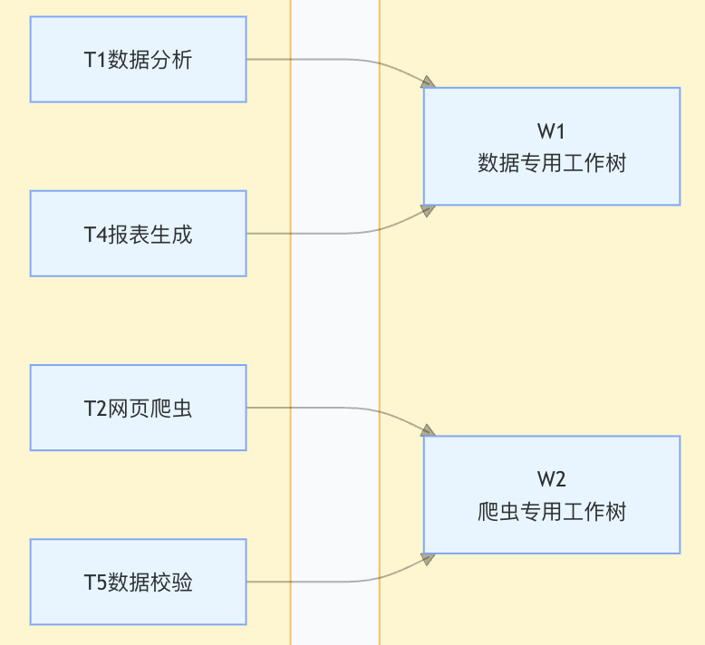

# s18_工作树与任务隔离

 本节主要介绍一下agent在运行过程中的工作树与任务隔离，当我们在用agent执行任务的时候，尤其是多agent同时执行任务的时候，如果所有的文件都在一个目录下很容易把文件改乱，工作树与任务隔离其实更多的是让不同任务之间彼此有自己的空间，这样多个人如果使用git项目管理的时候也不会出现冲突。

## 1. 什么是工作树与任务隔离

所谓工作树，其实就是一个单独的空间，比如说单独新建的一个文件夹，那么你可以指定你的任务所有产生的文件内容等都在这个固定文件夹下进行，不允许有修改别的文件夹的权利，类似模拟的一个沙箱环境一样。

任务隔离则是相对于每个任务task而言的，回顾我们之前的任务章节，agent通过规划方式可以产生很多task落磁盘然后按顺序执行。假如是多个Agent产生了很多task，那么这些task在执行的时候，如果都放在同一个目录下面，势必会产生一些相互的影响。比如说有两个task都需要生成一个名叫test.txt的文件，这个时候，因为在同一个目录下就会出现冲突，要么覆盖要么改写等不符合预期的情况。而任务隔离则是可以实现，即使两个Task同时执行，且同时生成了test.txt的文件，也不会出现冲突。那么怎么做到的呢？这就是本节的另外一个重点，某个Task可以绑定到某个工作树。

比如下面这个图，有4个任务task，当把不同task指定到不同的工作树上（也就是不同文件夹），那么当这个任务被执行时，所执行的路径就在对应工作树下的路径。


这里简单总结一下有无工作树的对比：
| 无隔离（传统方式） | 有隔离 |
| ---- | ---- |
| 所有任务在同一目录操作 | 每个任务在独立目录中执行 |
| 分支间修改互相覆盖 | `git worktree` 提供物理隔离 |
| `git stash` 来回切换容易丢代码 | 无需 `stash`，各自工作互不干扰 |
| 无法真正并行执行多个任务 | 多个工作树可真正并行 |
| 一个任务出错影响全局 | 任务失败只影响自己的工作树 |

## 2. 二者运转结构

基于上述描述，本节我们将涉及到的模块分为2个类别：
* 用于定义具体任务内容的 Task 模块，即控制平面；
* 用户实际的代码操作空间执行位置的模块，即执行平面；

```
+============================= 控制平面 (Control Plane) =============================+
|                                                                                 |
|   TaskManager (.tasks/)                                                         |
|   +-------------------+    +-------------------+    +-------------------+        |
|   | task_1.json       |    | task_2.json       |    | task_3.json       |        |
|   | status: pending   |    | status: in_prog.. |    | status: completed |        |
|   | worktree: ""      |    | worktree: "feat"  |    | worktree: ""      |        |
|   +-------------------+    +-------------------+    +-------------------+        |
|                                                                                 |
+=================================================================================+
                    |                       |
               bind_worktree()   bind_worktree()
                    |                       |
                    v                       v
+============================= 执行平面 (Execution Plane) ============================+
|                                                                                 |
|   WorktreeManager (.worktrees/)                                                  |
|   +-------------------+    +-------------------+                                |
|   | .worktrees/feat/  |    | .worktrees/fix/   |                                |
|   | branch: wt/feat   |    | branch: wt/fix    |                                |
|   | task_id: 2        |    | task_id: (none)   |                                |
|   | status: active    |    | status: active    |                                |
|   +-------------------+    +-------------------+                                |
|                                                                                 |
+=================================================================================+
```

控制平面通过 task.bind_worktree (绑定函数)与执行平面建立关联。任务可以不绑定工作树（纯规划），也可以绑定工作树（实际执行）。

看看2类数据在文件夹下的样子：
* 控制平面存储，也就是以前章节的task模块
```
.tasks/
  task_1.json
  task_2.json
  task_3.json
  ...
```
* 执行平面存储，新增的工作树文件夹
```
.worktrees/
  index.json        # 工作树注册表
  events.jsonl      # 事件日志
  auth-refactor/    # 实际的 worktree 目录
  fix-bug/          # 实际的 worktree 目录
  ...
```

那么一个task的具体内容可以更新格式为：
```
{
  "id": 12,
  "subject": "实现身份验证重构",
  "description": "将认证模块从单体拆分为微服务",
  "status": "in_progress",
  "owner": "",
  "worktree": "auth-refactor",
  "worktree_state": "active",
  "last_worktree": "auth-refactor",
  "closeout": null,
  "blockedBy": [],
  "created_at": 1715800000.0,
  "updated_at": 1715800123.4
}
```
可以看到一个任务增加了一些和worktree的内容，主要为具体的工作树目录和状态；

而在工作树的注册内容`index.json`里，每个工作树需要注册好位置与任务id，一个工作树的注册内容如下：
```
{
  "worktrees": [
    {
      "name": "auth-refactor",
      "path": "/path/to/repo/.worktrees/auth-refactor",
      "branch": "wt/auth-refactor",
      "task_id": 12,
      "status": "active",
      "created_at": 1715800000.0
    }
  ]
}
```

## 3. 具体类函数
有了以上基础了解后，来看看对具有工作树与任务隔离状态时的任务类和工作树类。

* 任务类 - TaskManager

这个类就是在任务模块使用过的类，只不过这里增加了关于绑定到任务树的一些子函数，详细的函数名如下：

| 方法                | 参数                              | 说明                                                                                                 |
| ------------------- | --------------------------------- | ---------------------------------------------------------------------------------------------------- |
| `create()`          | subject, description              | 创建新任务，ID 自增，初始状态 `pending`，`worktree_state` 为 `unbound`                                |
| `get()`             | task_id                           | 按 ID 获取任务详情                                                                                   |
| `exists()`          | task_id                           | 检查任务是否存在                                                                                     |
| `update()`          | task_id, status, owner         | 更新任务状态或所有者                 |
| `list_all()`        | --                                | 列出所有任务                   |
| `bind_worktree()`   | task_id, worktree, owner         | 绑定任务到工作树，更新`worktree_state`         |
| `unbind_worktree()` | task_id                           | 解除绑定，`worktree` 置空，`worktree_state` 设为 `unbound`                                            |
| `record_closeout()` | task_id, action, reason, keep_binding | 记录关闭操作            

该类的前五个方法其实就是以前的函数，只不过现在函数内部如果涉及到worktree的时候需要做一些调整。而后三个方法则是和WorkTree相关的一些新增函数，包括指定某个任务绑定到对应的工作树，解绑等等。

* 工作树 - WorktreeManager

WorktreeManager 管理 git worktree 的完整生命周期，包括创建、列表、进入、执行命令、状态查看、保留、删除和关闭。


| 方法          | 参数                                   | 说明                                                                 |
| ------------- | -------------------------------------- | -------------------------------------------------------------------- |
| `create()`    | name, task_id？, base_ref？          | 创建工作树，可选绑定任务 |
| `list_all()`  | --                                     | 列出 index.json 中所有工作树                                          |
| `enter()`     | name                                   | 进入工作树，更新 `last_entered_at`                                    |
| `run()`       | name, command                          | 在工作树目录中执行命令（有危险命令拦截）|
| `status()`    | name                                   | 查看工作树的 `git status`                                             |
| `remove()`    | name, force? complete_task? reason?  | 删除工作树，可选标记任务完成                                          |
| `keep()`      | name                                   | 保留工作树，记录 closeout 为 `kept`                                   |
| `closeout()`  | name, action, reason? force? complete_task? | 统一关闭入口，action 为 `keep` 或 `remove` |


任务与工作树之间是多对一的关系：一个工作树最多绑定一个任务，但一个任务可以先后绑定不同的工作树（last_worktree 记录最后一个）。基于这种机制，不同的任务就可以并行的或者随时的在不同的任务树之间运行，且不会相互干扰，并且也具备一些追溯机制，这对于大任务来说，还是很重要的。

以上两个类中，涉及到的一些函数自然也是需要注册到工具里面，才能方便Agent的调用。

## 4. 简单示例

* 示例 1：创建任务并绑定工作树
```
>> 我需要重构认证模块，请创建任务并分配工作树

[agent 调用工具链]

1. task_create(subject="重构认证模块", description="将认证从单体拆分为微服务")
   返回: { "id": 12, "status": "pending", "worktree_state": "unbound", ... }

2. worktree_create(name="auth-refactor", task_id=12, base_ref="HEAD")
   - emit "worktree.create.before"
   - git worktree add -b wt/auth-refactor .worktrees/auth-refactor HEAD
   - 注册到 .worktrees/index.json
   - task.bind_worktree(12, "auth-refactor")
     - task.status: pending -> in_progress
     - task.worktree_state: unbound -> active
   - emit "worktree.create.after"

3. worktree_run(name="auth-refactor", command="ls src/auth/")
   在 .worktrees/auth-refactor/ 目录中执行
```

这里简单展示一下整个过程，其中关于第三个函数`worktree_run`这个函数的入参说明它只能够执行command命令。

那么问题来了，如果说要在工作树中执行LLM读写到指定工作树怎么办？其实重点就是path参数，不管是读还是写，只要带上了工作树的路径参数以后，那么就能够绑定到对应的工作树中。

* 示例 2：完成后关闭工作树（删除）
```
>> bug修复已合并，删除工作树

[agent 调用]

worktree_closeout(name="fix-bug", action="remove", force=False, complete_task=True)
- emit "worktree.closeout.remove"
- emit "worktree.remove.before"
- git worktree remove .worktrees/fix-bug
- task.update(5, status="completed")
  - emit "task.completed"
- record_closeout(5, "removed", keep_binding=False)
  - task.worktree_state = "removed"
  - task.worktree = ""
- index.json: status="removed"
- emit "worktree.remove.after"
```

## 5. 其他问题

整理几个可能碰到的小问题。

* 为什么不用 git branch + checkout？
git checkout 切换分支时，工作目录会被整体替换，无法同时操作多个分支。git worktree 允许多个分支同时存在于不同目录，实现真正的物理隔离和并行操作。

* 一个任务可以绑定多个工作树吗？
不可以。任务模型中只有一个 worktree 字段，同一时间只能绑定一个工作树。但任务可以先后绑定不同工作树，last_worktree 字段会记录最后一次绑定的名称。一个工作树也只记录一个 task_id。

本节关于工作树的主体内容大概就是这个样子。


