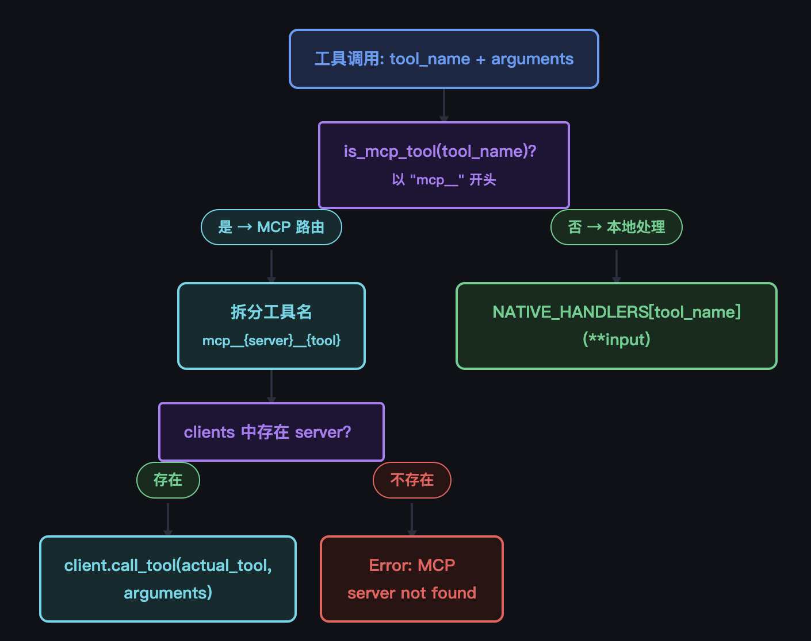

# s19_关于mcp与插件系统

本节主要介绍mcp相关的知识，MCP 全称Model Context Protocol（模型上下文协议），作为增强agent能力的一个重要组成部分，mcp可以直接让agent具备一些调用外部现成开发好的工具的能力，这比自己从头开发要强得多。有了mcp可以说agent具备与外界沟通的与借助外界力量的能力。

## 1. 什么是mcp

通俗的mcp说白了就是一个远程云端部署的一个工具服务，该工具可以对外暴露一些开发接口，任何人知道了部署端的ip和接口以及调用参数，都可以请求这个接口，这个接口可以根据请求的参数来选择性远程执行某些工具函数并返回结果，使用端拿到了云端返回结果就算完成了本次mcp工具的调用了。

整个过程就是这个样子，细分下来其实就涉及到2个角色：
* 本地端（使用方）：准确配置好ip与端口，了解mcp服务端提供具体工具参数，使用时按参数发送请求即可；
* mcp服务端：需要开发服务端的工具函数，需要将整个服务部署并运行，需要对外暴露某些可用工具，需要能接受到请求后并返回结果。

## 2. 服务端mcp开发

从上mcp的2个角色也可以看出，mcp环节中主要的部分还是服务端mcp的开发，使用端也就是agent更多的是配置一下端口协议即可。所幸的是大多是时候我们作为使用方直接接当前网络上部署好的mcp即可，只有当我们自己需要开发和部署一些mcp供自己agent使用的时候才涉及到mcp的开发。

常规服务端提供mcp的能力除了工具调用外，还提供一些静态资源等功能，如：
| 资源类型                | 作用                                   | 通俗理解             |
| ----------------------- | -------------------------------------- | -------------------- |
| Tool（工具）| 让 AI 执行动作、修改状态、调用功能     | 按钮 / 遥控器        |
| Resource（资源）| 让 AI 读取数据、获取上下文、查看状态   | 文件 / 数据库 / 信息面板 |
| Prompt（提示词模板）| 让 AI 使用预设的高质量提示词           | 话术模板 / 指令模板  |

假设我们需要自己开发mcp服务端部署起来，市面上有一些标准框架提供，以python为例，`FastMCP`就是一套使用较广的框架，在此框架上很容易做工具函数的开发和部署。一个简单的代码架构：

```
# 最简 MCP 服务：包含 工具(Tool) + 资源(Resource) + 提示词(Prompt)
from fastmcp import FastMCP

# 初始化 MCP 服务
mcp = FastMCP("极简三合一MCP")

# ==============================================
# 1. Tool 工具：AI 能执行的动作（会改变状态）
# ==============================================
@mcp.tool
def add(a: int, b: int) -> str:
    """做加法计算
    Args:
        a: 数字1
        b: 数字2
    """
    return f"计算结果：{a} + {b} = {a + b}"

# ==============================================
# 2. Resource 资源：AI 能读取的数据（只读）
# ==============================================
@mcp.resource("info://system")
def get_system_info():
    """获取系统信息"""
    return {
        "name": "极简MCP服务",
        "version": "1.0.0",
        "status": "running"
    }

# ==============================================
# 3. Prompt 提示词：AI 能用的思考模板
# ==============================================
@mcp.prompt("help_me_think")
def help_me_think(topic: str):
    """帮我思考问题的提示词模板"""
    return f"""
请你围绕主题：{topic}
按以下步骤思考：
1. 理解问题
2. 给出方案
3. 总结结论
"""

# 启动服务
if __name__ == "__main__":
    mcp.run()
```

这里就包含了一个远程部署mcp所能提供的几类功能。

这里要多说一个**非常关键的点**，当自己开发mcp工具的时候，对于函数的描述部分也就是`"""xxx"""`的部分非常重要，这部分的内容连同函数名称是会出现在后续agent的工具列表中的，它提醒了agent什么情况下可以调用该工具函数，描述的越清晰直观，大模型才能在合适的时候准确调用该工具函数，如同agent调用内部工具函数一样。

大多数时候mcp是部署到远程服务器上比较好，当然你也可以在本地部署一个mcp服务端，相当于你本地agent自己调用请求本地的mcp服务器了。远程服务端部署也分不同类型的请求方式：
| 传输方式     | 适用场景                                                 |
| ------------ | -------------------------------------------------------- |
| STDIO        | 本地进程调用（本机 IDE / 客户端直连，你的本地 Git 任务服务） |
| HTTP Stream  | 云端部署、生产环境首选，流式长连接、会话续连、权限校验     |
| SSE          | 历史方案，逐步被 HTTP Stream 替代                         |
| WebSocket    | 高频实时推送场景                                         |

## 3. 本地agent使用mcp

无论是部署在远程服务器上的还是本地上的mcp，一旦部署完运行起来后，就可以使用agent进行请求访问了，为了能正确访问到，本地agent中是需要一些配置的。

* mcp的发现
通常情况下，需要在配置文件中配置好连接服务的端口ip、鉴权key（如有）等才能访问远程mcp，这类配置一般在本地：`plugin.json` 或者 `mcp.json` 类似文件中，格式例如：

```
{
  "mcpServers": {
    "git-mcp": {
      "url": "http://192.168.1.100:8090/mcp",
      "headers": {"X-Api-Key": "xxx"}
    },
    "db-mcp": {
      "url": "https://mcp-db.xxx.com/mcp",
      "headers": {"Authorization": "Bearer abc123"}
    }
  }
}
```
比如类似这种，配置了2类远程mcp，那么这些mcp中定义的一些工具、资源就可以被本地使用。

* agent本地自带的`MCP Client`
正常来说，agent本地是需要一套用于解析转发远程mcp资源的本地客户端的，这样才能保证远程资源与工具的正常解析与使用。

* mcp工具函数动态加载到本地agent工具箱
本地agent在启动后并正确加载mcp后，是可以获取到mcp对外暴露的工具列表和参数说明的，这个时候，mcp的工具函数和本地的工具函数就会混合在一起作为agent的TOOLS列表供大模型使用。一个细节在于，mcp的工具函数实现的时候会增加`mcp_xxx`前缀以示区分本地工具。同时如果本地工具和mcp工具同时有工具函数实现同一个功能，一般以本地函数优先。

mcp与本地工具混合后在agent上的调用链路如下：



## 4. 总结

本节核心探索mcp在agent中的运行原理机制，mcp如今已经发展成为比较成熟且核心的模块在agent生态当中，作为访问外部数据源的一个主要手段能显著增加agent的能力。


